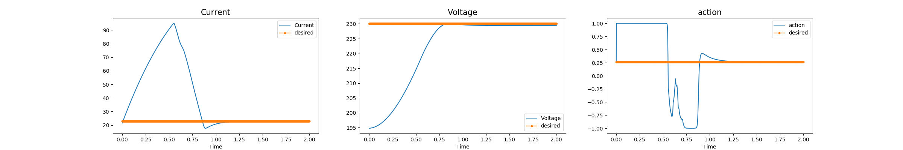

# kristools: Custom Multi Agent Reingforcement Learning (MARL) for safety and stability.

This is a custom multi-agent reinforcement learning (MARL) algorithm designed to ensure safety and stability in networked systems proposed in [[1]](#1). The algorithm employs a control barrier function (CBF) to identify the set of controllers that enforce a dissipativity condition on each subsystem. It then utilizes a minimal energy perturbation on the control input learned by the RL algorithm to project it onto an input within this set. The result is a guarantee of stability for the entire networked system, even when the subsystems are utilizing potentially heterogeneous RL algorithms to design their local controllers.


The algorithm is described in Algorithm 1, which can be found in the code repository at the following link: https://github.com/asokraju/kristools/blob/d23bbb49d2ac67d4750a55c728d9b631ef4633b3/results/algorithm.PNG


Our approach of utilizing a CBF to impose the constraint that the controller designed for each subsystem preserves the subsystem's dissipativity in the closed loop is similar to the use of CBFs to enforce safety in RL algorithms. CBFs guarantee the existence of control inputs under which a super-level set of a function (typically representing specifications like safety) is forward invariant under a given dynamics. However, their use to impose input-output properties such as dissipativity is less studied. In this algorithm, we utilize CBFs to characterize the set of dissipativity-ensuring controllers, and then learn a dissipativity-ensuring controller for each subsystem from this set.


## References
<a id="1">[1]</a> 
Kosaraju, K. C., Sivaranjani, S., Suttle, W., Gupta, V., & Liu, J. (2021). 
Reinforcement learning based distributed control of dissipative networked systems. 
IEEE Transactions on Control of Network Systems, 9(2), 856-866.

The code repository also contains tools for implementing custom MARL algorithms in systems described in Gym environments. These tools include basic implementations of Reinforcement Learning algorithms and gym environments, with a focus on systems with continuous state and action spaces. This also includes:
[1] gym environments:
- [DC-DC buck converter](rl/gym_env/buck.py)
- [DC-DC boost converter](rl/gym_env/boost.py)
- [four node buck (DC) microgrid](rl/gym_env/buck_microgrid.py)

[2] RL algorithms
- ```buck_ddpg``` run DDPG on a simple buck converter environment.


[3] Bash scripts for hyperparameter turning in high-performance cluster 
- [Run file to  organize the folders](https://github.com/asokraju/kristools/blob/e41eb5ff0f6b6ded45129a322c609c47ea5cf041/my_scripts/gpu_batch.sh)
- [Script for Hyperparameters](https://github.com/asokraju/kristools/blob/e41eb5ff0f6b6ded45129a322c609c47ea5cf041/my_scripts/run_script.sh)

# How to use?
```python buck_ddpg --gamma=0.9 --max_episodes=100 --actor_lr=0.0001 --critic_lr=0.01 summary_dir='./results_buck_ddps'```
will run the ddpg algorithm on buck converter, with discount factor = 0.9, for 100 episodes, and actor and critic learning rates 0.0001, 0.01, respectively. Finally saves the results in the folder = './results_buck_ddps' (the folder should be available)

# Complete argument list:

Use argparse to set the parameters of the desired experiment. Running buck_ddpg.py as a script will then output the results to a named and dated directory in the results folder.

```summary_dir``` folder path to load and save the model. Saved all the results in .mat format.

```save_model``` (```bool```) if ```True``` saves the model in the ```summary_dir```

```load_model``` (```bool```) if ```True``` loads the model in the ```summary_dir```

```random_seed```  (```int```)  seeding the random number generator (NOT completely implemented)

```buffer_size``` (```int```) replay buffer size

```max_episodes``` (```int```) max number of episodes for training

```max_episode_len``` (```int```) Number of steps per epsiode

```mini_batch_size``` (```int```) sampling batch size drawn from replay buffer

```actor_lr``` (```float```) actor network learning rate

```critic_lr``` (```float```) critic network learning rate

```gamma``` (```float```) models the long term returns (discount factor)

```noise_var``` (```float```) starting variance of the exploration noise at each episode, and decreased as the episode progress

```scaling```  (```bool```) If ```True``` scales the states before using for training

```state_dim``` (```int```) state dimension of environment

```action_dim``` (```int```) action space dimension

```action_bound``` (```float```) upper and lower bound of the actions

```discretization_time``` (```float```) discretization time used for the environment

### Actor and Critic network is implemented using LSTM's + two hidden layers

```time_steps``` (```int```) Number of time-steps for rnn (LSTM)

```actor_rnn``` (```int```) actor network rnn layer paramerters

```actor_l1``` (```int```) actor network layer 1 parameters

```actor_l2``` (```int```) actor network layer 2 parameters


```critic_rnn``` (```int```) critic network rnn layer paramerters

```critic_l1``` (```int```) critic network layer 1 parameters

```critic_l2``` (```int```) critic network layer 2 parameters

```tau```  (```float```)  target network learning rate


# Dependencies

Written in TensorFlow 2.0 (Keras)

Requires the following PiPy packages
```
import matplotlib.pyplot as plt
import numpy as np
import gym
from gym import spaces
import matplotlib.pyplot as plt
import argparse
import tensorflow as tf
from tensorflow import keras
from tensorflow.keras import Input, Model, Sequential, layers
import datetime
from scipy.io import savemat
import os
import argparse
import pprint as pp
```
